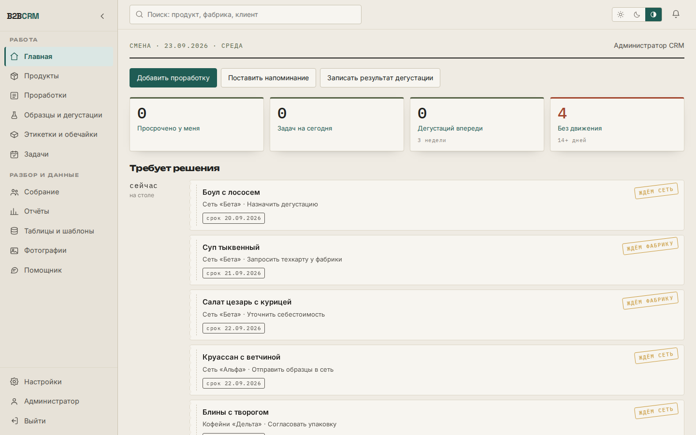
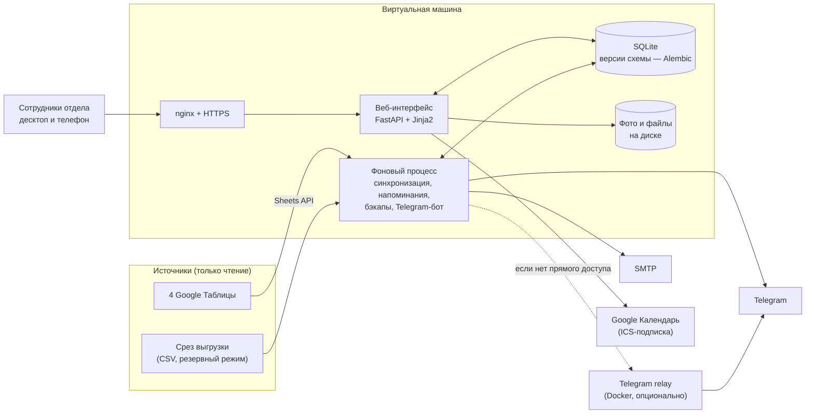
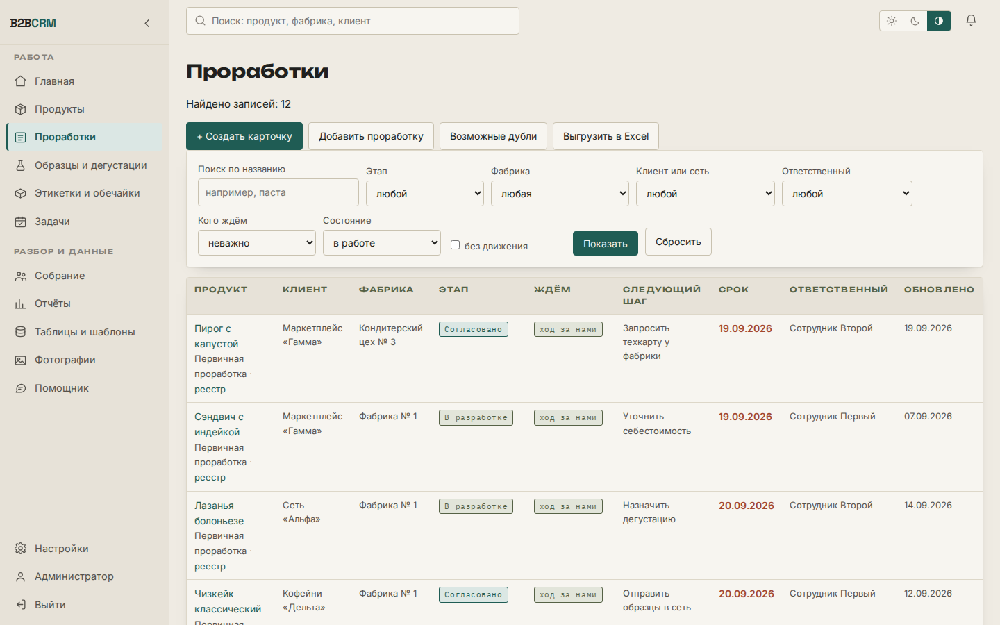
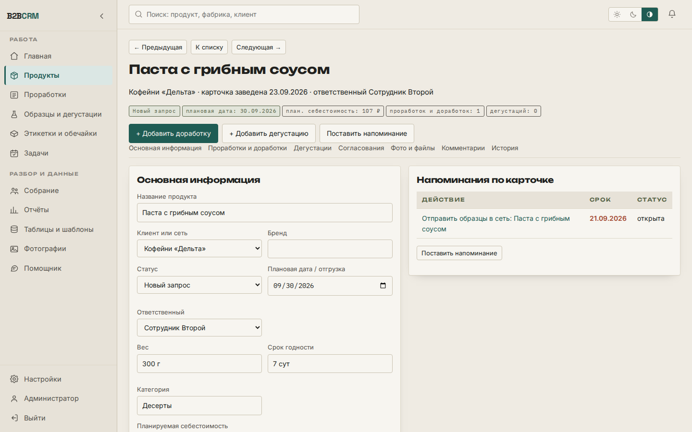
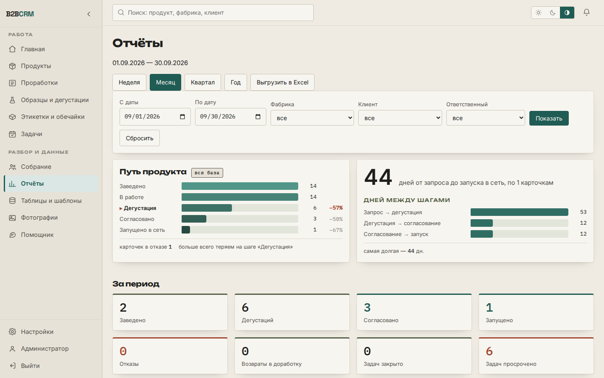
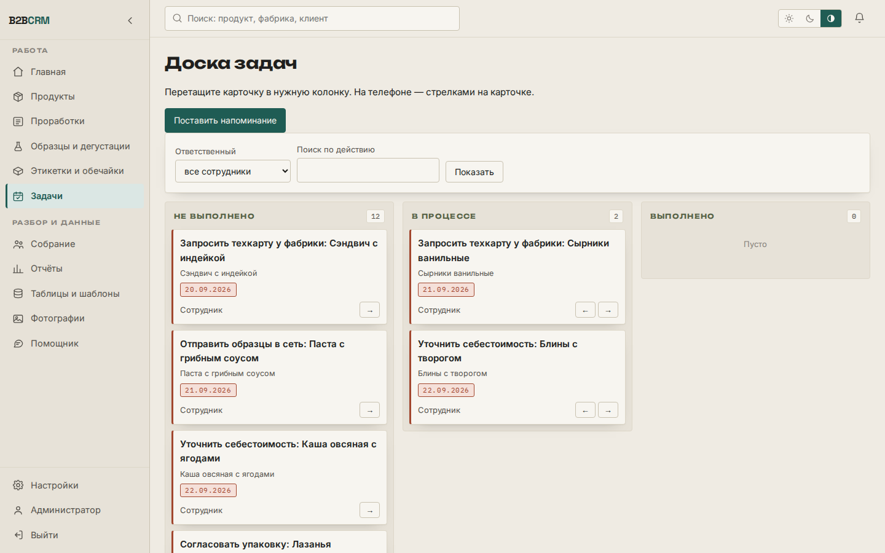
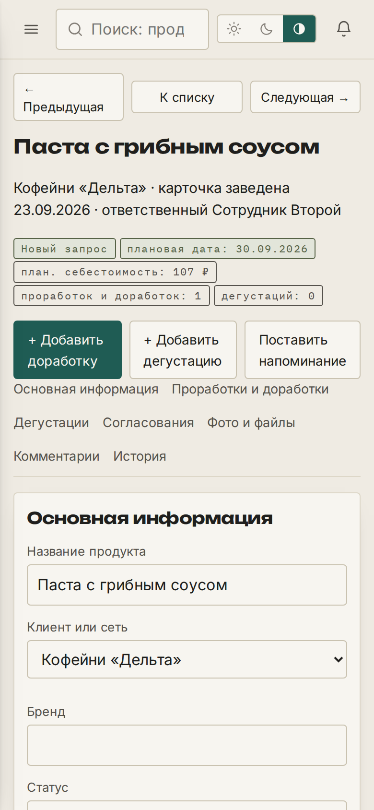

# B2B CRM для отдела разработки продуктов

Период: 09.2026 – 09.2026

> Внутренняя CRM отдела B2B производителя готовой еды: проработки новых продуктов, образцы, дегустации, заказ упаковки, задачи с напоминаниями и отчёты — в одном окне вместо четырёх Google Таблиц.

## Задача

Отдел B2B вёл работу с сетями-клиентами и фабриками в четырёх Google Таблицах: проработки продуктов, отправки образцов, этикетки и обечайки, заказы от сетей. Таблицы отвечали на вопрос «что есть», но не на вопросы, которыми отдел живёт каждый день:

- что сейчас в работе и на каком этапе каждая позиция;
- от кого ждём ответа и кто отвечает за следующий шаг;
- когда вернуться к вопросу и чем закончилась проработка.

Следующего шага, срока, ответственного, напоминаний и истории изменений в таблицах не было. При этом ломать привычные таблицы было нельзя: они остаются рабочим источником.

## Решение

Веб-приложение, которое читает таблицы **только на чтение** и добавляет поверх них то, чего в них нет:

- **Единая карточка продукта.** Продукт заводится один раз; первичная проработка, доработки, дегустации, согласования, фото, комментарии и история копятся внутри карточки и ничего не перезаписывают. История «было → стало» собирается автоматически.
- **Главная «что требует внимания»:** просроченное, задачи на сегодня, ближайшие дегустации, ожидания ответов, проработки без движения.
- **Реестр проработок** с фильтрами по этапу, фабрике, клиенту, ответственному и «кого ждём», выгрузка в Excel по текущим фильтрам.
- **Задачи и напоминания:** канбан-доска, повторения (включая «последний день месяца»), перенос сроков, подписка на задачи в Google Календаре (ICS). Напоминания рассылает отдельный фоновый процесс, поэтому они приходят при закрытом браузере.
- **Ежемесячный заказ упаковки** без дублей при повторном формировании.
- **Отчёты:** путь позиции «заведено → дегустации → согласовано → запущено», динамика, срезы по фабрикам, клиентам и ответственным, причины отказов.
- **Режим собрания:** разбор позиций по фабрике или сети с записью решений прямо в списке.
- **Помощник:** ответы по данным CRM и создание задачи из обычной фразы — в интерфейсе и в Telegram.
- **Уведомления:** внутри CRM, e-mail и Telegram (личные напоминания и объявления в чаты отдела).
- **Роли:** администратор, сотрудник, наблюдатель; самостоятельная регистрация по рабочей почте с одобрением администратора.

## Моя роль

Командный проект, моя часть: основа CRM — модель данных, импорт из Google Таблиц и сервисы; интерфейс, напоминания и отчёты; помощник в Telegram; резервное копирование; загрузка фото и мобильный интерфейс; развёртывание на сервере (службы systemd, nginx, скрипты установки и обновления); версии схемы на Alembic; выгрузки в Excel; доска задач; самостоятельная регистрация сотрудников по почте; единая карточка продукта; дашборд в отчётах; рассылка объявлений в чаты отдела; склейка дублей в справочниках; инструкция для сотрудников отдела.

## Архитектура

Компоненты, сделанные коллегами: relay-сервис для Telegram и повторная отправка уведомлений.

## Стек

- **Backend:** Python, FastAPI, Jinja2 (серверный рендеринг), SQLAlchemy 2, Alembic
- **Хранилище:** SQLite (файлы — на диске, в базе только описание)
- **Интеграции:** Google Sheets API (сервисный аккаунт), SMTP, Telegram Bot API, ICS для календаря
- **Файлы:** Pillow + pillow-heif (HEIC → JPEG, поворот по EXIF, миниатюры), openpyxl (выгрузки в Excel)
- **Безопасность:** шифрование паролей почты и токена бота в базе (cryptography), роли и сессии
- **Инфраструктура:** VPS, nginx, systemd (две службы: веб и фоновый процесс), установка одной командой, Docker для relay-сервиса
- **Тесты:** сквозные сценарии через веб-интерфейс, проверка мобильной вёрстки через Playwright

## Ключевые технические решения

- **Таблицы остаются источником, CRM не пишет в них.** Синхронизация обновляет только «поля источника», а поля CRM (следующий шаг, срок, ответственный, итог, задачи) не трогает.
- **Стабильный ключ строки** — отпечаток содержимого (для проработки: позиция + контрагент), а не номер строки: перестановка строк в таблице не рвёт связь с карточкой. Пропавшие строки помечаются «нет в таблице», но не удаляются.
- **Дубли не склеиваются автоматически** — система находит кандидатов по названию и показывает их человеку.
- **При сбое синхронизации** остаются последние успешные данные, а ошибка видна на экране источников и в нижней строке каждого экрана.
- **Два режима источника:** живое чтение через API или срез выгрузки — текущий режим и время последней синхронизации всегда показаны, ничего не имитируется.
- **Напоминания — в отдельном процессе,** а не в браузере: задача доставляется при закрытой вкладке.
- **Фото сжимаются в браузере до отправки:** по README, снимок с телефона 7,7 МБ уходит на сервер как 0,4 МБ; если браузер не справился — файл уходит как есть, и сервер разбирает его сам.
- **Графики отчётов рисует сама CRM,** без внешних библиотек и сторонних запросов со страницы; значение подписано у каждого столбика, чтобы график читался без различения цветов.
- **Удаление — только администратором и с записью в историю;** удаление карточки требует ввести название продукта вручную.
- **Резервные копии** — раз в сутки средствами SQLite без остановки системы, хранятся последние 14.

## Результат

По README и документации репозитория:

- Перенесены данные из всех четырёх таблиц; работают реестр и карточки, образцы и дегустации, заказ упаковки, задачи с повторениями, фоновый планировщик, отчёты с выгрузкой в Excel, поиск, режим собрания, помощник, роли, журналы, резервное копирование и мобильный интерфейс.
- Приёмка: сквозные сценарии из задания (напоминание при закрытом браузере, повтор «в конце месяца», прекращение напоминаний после выполнения, заказ упаковки без дублей, итог в отчёте за нужный период, ссылки на исходные таблицы, ответ бота со ссылкой на карточку) — **последний прогон: 33 проверки, все успешно**; дополнительно проверено, что открываются все 13 разделов.
- Живой планировщик доставил напоминание с прошедшим сроком за один шаг (30 секунд) без открытого браузера.

## Скриншоты

Сняты на локальном стенде со сгенерированными данными (вымышленные продукты, сети, фабрики и сотрудники).

| Реестр проработок | Карточка продукта |
|---|---|
|  |  |

| Отчёты | Доска задач |
|---|---|
|  |  |

