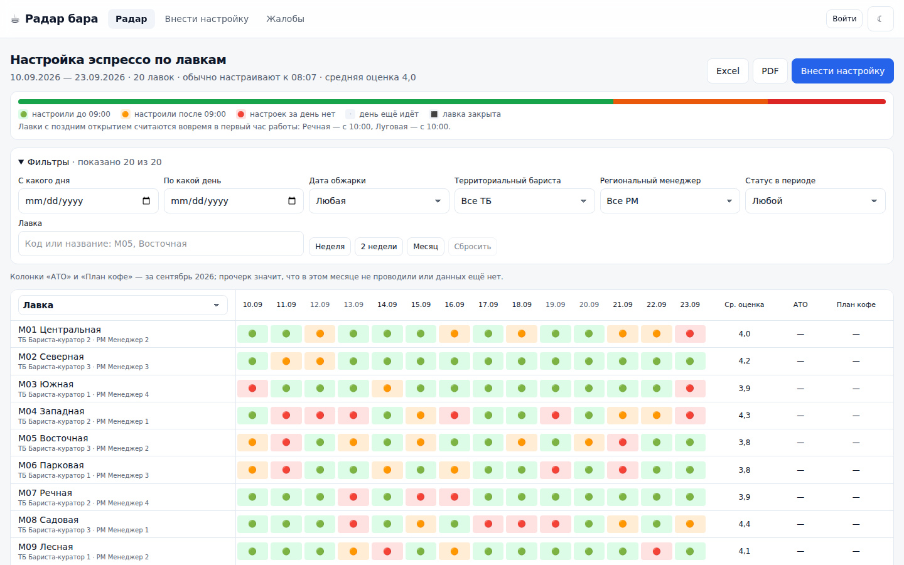
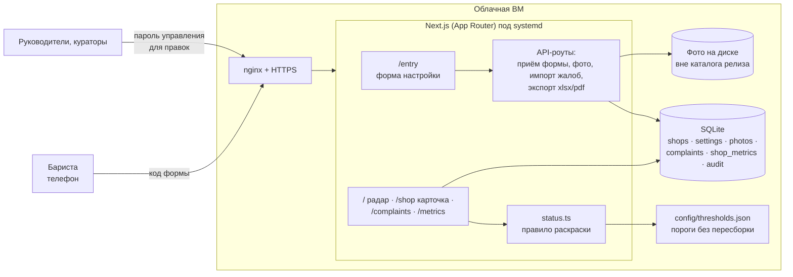
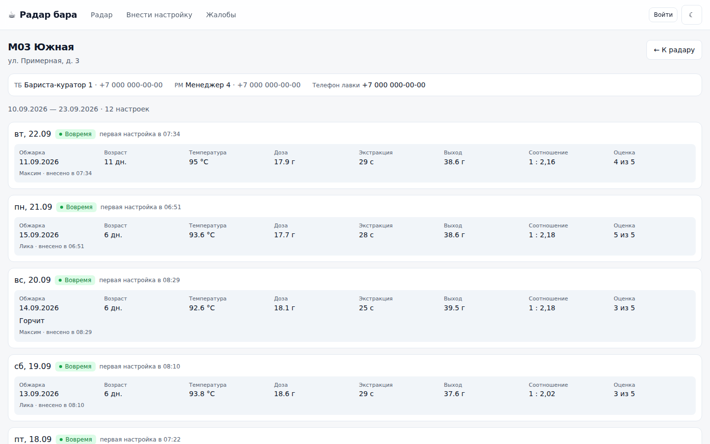
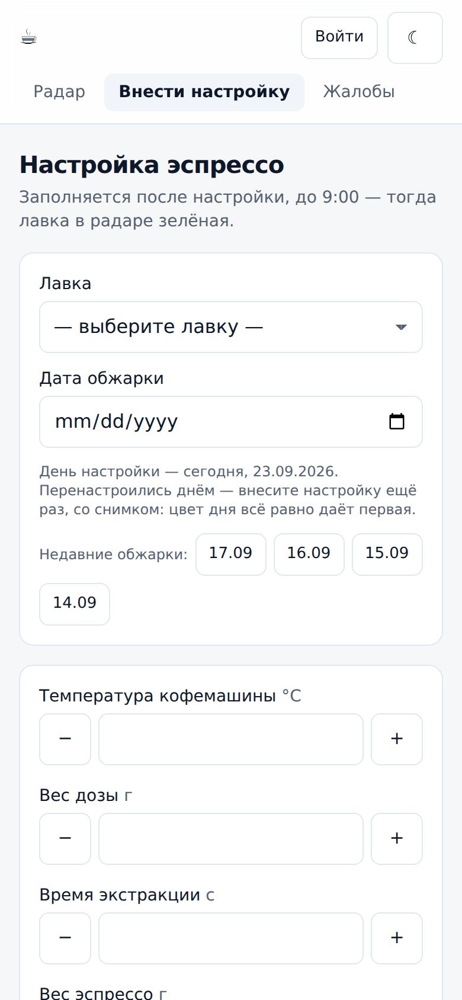

# Радар бара: контроль ежедневной настройки эспрессо

Период: 09.2026 – 09.2026

> Веб-сервис для сети кофеен при кулинарных лавках: кто и во сколько настроил эспрессо, на какой обжарке и насколько вкусно вышло. Бариста вносит настройку с телефона со снимком чашки, руководитель видит всю сеть в одной таблице.

## Задача

Три задачи от заказчика:

1. **Видеть в динамике, во сколько открыт и настроен бар** в каждой из лавок сети.
2. **Видеть, на какой обжарке варят,** и влиять на настройку дистанционно.
3. **Не тратить сырьё на подбор с нуля** каждое утро.

Плюс — связать жалобы гостей на кофе с конкретной обжаркой.

## Решение

- **Радар — таблица «лавки × дни».** 🟢 настройку внесли до порога (по умолчанию 9:00), 🟠 — после, 🔴 — за день настроек нет, ⬛ — лавка закрыта. У лавок с поздним открытием свой порог — первый час работы.
- **Форма бариста с телефона:** сегодняшний день, параметры (температура, доза, время экстракции, выход, оценка), обязательный снимок эспрессо. Форма показывает свою прошлую удачную настройку и настройки других лавок на той же обжарке — «увидел, на чём остановились соседи, повторил».
- **Карточка лавки:** все настройки по дням, контакты кураторов, журнал правок.
- **Жалобы:** по одной через форму или пачкой из файла (xlsx, xls, csv) — рядом с жалобой стоит дата обжарки.
- **Месячные показатели** (результат аудита и выполнение плана по кофе) с разделением «не проводили» и «0 %».
- **Выгрузки** ровно того, что на экране: Excel (радар, плоский список настроек, жалобы) и PDF с листом «кому звонить в первую очередь».

Сервис сделан по образцу [«Радара открытий»](opening-radar.md): тот же стек, та же раскраска, тот же способ деплоя — чтобы человек, знающий один радар, сразу понимал второй.

## Моя роль

Проект делал один: архитектура, разработка, деплой. По коду — также правило раскраски с порогами в конфиге, приём формы и фото одним запросом, импорт жалоб из xlsx/xls/csv, выгрузки в Excel и PDF, тесты на node:test, скрипты развёртывания (systemd, nginx, deploy.sh) и Python-скрипт сборки справочника лавок.

## Архитектура

## Стек

- **Приложение:** Next.js 16 (App Router), React 19, TypeScript, Tailwind CSS 4
- **Хранилище:** SQLite (better-sqlite3), фото — файлами на диске
- **Отчёты и импорт:** SheetJS (Excel), pdfmake (PDF со шрифтом с кириллицей)
- **Инфраструктура:** облачная ВМ, nginx, systemd, релизы через симлинк `current` (откат = переставить симлинк)
- **Тесты:** node:test через tsx
- **Вспомогательное:** Python-скрипт сборки справочника лавок из двух Excel-файлов

## Ключевые технические решения

- **Цвет дня — по первой настройке.** Перенастройка вносится отдельной записью и не перекрашивает день: успели утром — зелёный, обеденная перенастройка его не отнимет; проспали утро — вечерняя не спасёт.
- **Сегодня до порога — пусто, а не красный:** красный означает «день проигран», а день ещё идёт.
- **Настройка задним числом не даёт зелёный:** время внесения ставится концом дня; вносить задним числом может только руководитель.
- **День, лавка и время внесения не правятся никем** — из них собран цвет ячейки. Право решает сервер, а не кнопка: подменить лавку или день через тело запроса нельзя.
- **Снимок обязателен и едет вместе с цифрами одним неделимым запросом:** или сохраняется всё, или ничего. Фото уменьшается в телефоне до 1600 px; если браузер не смог его обработать (например, HEIC) — уезжает оригинал.
- **Формат файла проверяется по первым байтам,** а не по расширению.
- **Защита от двойного нажатия:** вторая настройка той же лавки в пределах двух минут не принимается.
- **Мягкое удаление и журнал правок:** удалённая настройка пропадает из радара, подсказок и выгрузок, но остаётся в базе и возвращается одной кнопкой; каждое изменение пишется в `audit` («было → стало»).
- **Терпимый импорт жалоб:** заголовки ищутся по смыслу, лавка узнаётся по коду или названию, дата — в любом из распространённых форматов; нераспознанная строка возвращается с причиной, а не роняет файл; пачка пишется одной транзакцией.
- **Всё время — в московском поясе через `Intl`,** а не через смещение: сервер в облаке живёт в UTC, и вечерняя настройка иначе уезжала бы во вчерашний день.
- **SQLite вместо Postgres осознанно:** по README, это меньше двадцати тысяч строк в год; второй сервис добавил бы работы по эксплуатации, не дав ничего взамен. Доступ к данным изолирован в двух модулях — переезд затронет только их.
- **Токен доступа к приватному репозиторию** передаётся переменной окружения и не вшивается в адрес репозитория, чтобы не оседать в `.git/config` и логах.

## Результат

По README репозитория:

- Сервис развёрнут на облачной ВМ и охватывает **54 лавки** сети.
- Все три задачи заказчика закрыты: радар по времени настройки, фильтр и подсказки по обжарке, подсказки удачных настроек в форме.
- Тестами покрыты места, где ошибка «тихая»: перевод времени в часовой пояс, правило раскраски, разбор формы, правила внесения, права на правку, разбор файла жалоб.

## Скриншоты

Сняты на локальном стенде: справочник из 20 вымышленных лавок, демо-настройки встроенным генератором проекта.

| Карточка лавки | Форма бариста (телефон) |
|---|---|
|  |  |
