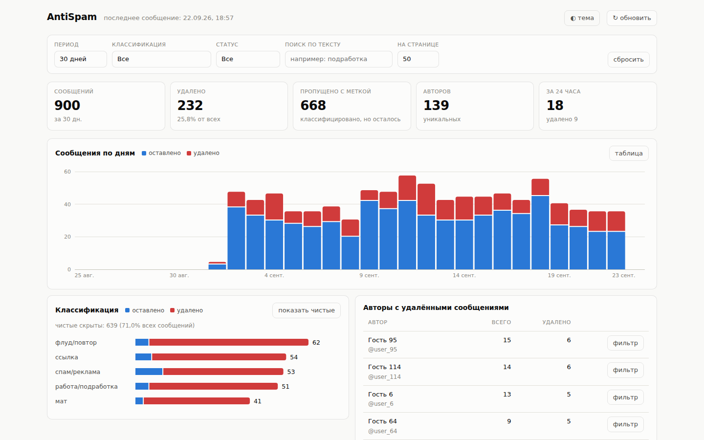
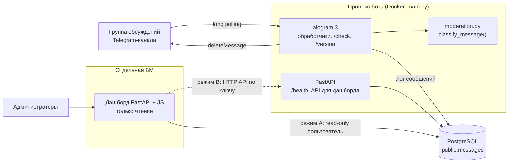
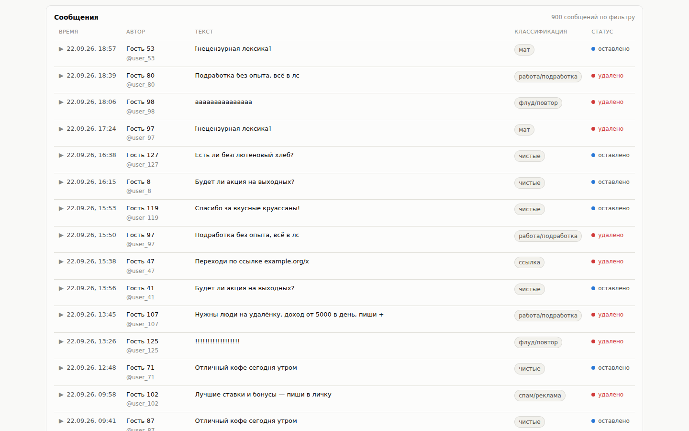

# Антиспам-модератор комментариев Telegram-канала + дашборд

Период: 09.2026 – 09.2026

> Бот, который удаляет спам, ссылки, мат и «предложения заработка» из комментариев Telegram-канала сети кулинарных лавок, не трогая обычные вопросы и жалобы клиентов. Плюс отдельный read-only дашборд со статистикой модерации.

## Задача

Из комментариев к постам канала сети нужно было убирать ссылки, рекламу, «подработку без опыта», казино, контент 18+ и мат. При этом обращения клиентов — вопросы про магазины, бонусы, приложение, продукты, жалобы — должны оставаться в чате. Нужен был модератор, который:

- удаляет только очевидные нарушения;
- не удаляет сообщения администрации;
- объясним: всегда понятно, почему сообщение удалено или осталось.

## Решение

- **Правила модерации** в одном модуле: `classify_message(text, has_link)` возвращает категорию нарушения или `None`. Категории: ссылка, мат (включая завуалированные варианты), реклама/спам, вакансии и подработка с рекламным призывом, 18+, казино/ставки, флуд.
- **Исключения:** белый список ссылок (с точностью до пути, а не домена), сообщения администраторов и владельца чата, автопересылки из привязанного канала, анонимные админы.
- **Команды самодиагностики в чате:** `/check <текст>` — вердикт, сработавшее правило и версия правил (заблокированный текст обратно не печатается); `/version` — отпечаток правил и идентификатор процесса.
- **Логирование** сообщений и классификаций в PostgreSQL (опционально) и HTTP-API для дашборда.
- **Дашборд:** плитки (всего, удалено, «пропущено с меткой», авторы, активность за 24 часа), сообщения по дням, разбивка по классификации, топ авторов с удалёнными сообщениями, таблица сообщений с фильтрами и раскрытием детализации.

## Моя роль

Командный проект, моя часть: read-only дашборд модерации; исправление ложных срабатываний и единая классификация вердиктов; команды самодиагностики `/check` и `/version` с отпечатком правил; честный healthcheck (бот «работает» только после успешного `getUpdates`, конфликт 409 виден); корректное завершение по SIGTERM; диагностический скрипт Telegram-стороны; разбор ссылок через `urlsplit` и белый список для канала компании и модераторов; категория 18+; тесты на то, что команды доходят до обработчиков.

## Архитектура

## Стек

- **Бот:** Python, aiogram 3, FastAPI + uvicorn (веб-часть в том же процессе)
- **Данные:** PostgreSQL (psycopg 3)
- **Дашборд:** FastAPI, psycopg-pool, httpx, статичный фронтенд на JS
- **Инфраструктура:** Docker / Docker Compose, платформа с автодеплоем
- **Тесты:** pytest — модерация, исключения, команды бота, завершение процесса, идентификация процесса, троттлинг логов

## Ключевые технические решения

- **Тесты на «что обязано остаться», а не только «что удалить».** Пример из README: фильтр мата однажды ловил корень внутри слова «мандарины» — такие кейсы закреплены тестами, иначе легко начать удалять обычных клиентов.
- **Разбор URL через `urlsplit`, а не сравнением подстрок:** адрес вида `https://t.me@evil.com/...` на самом деле ведёт на `evil.com`. Адреса берутся и из сущностей Telegram — у скрытой ссылки подпись может выглядеть безопасно, а вести куда угодно.
- **Разрешённая ссылка снимает вердикт только про ссылку** — остальные правила продолжают работать.
- **Проверка прав автора — только для уже признанных нарушений,** чтобы не делать лишний запрос к Telegram на каждое чистое сообщение.
- **Честный healthcheck:** `bot_running` становится `true` только после успешного `getUpdates`; `bot_state` различает `starting`, `polling`, `conflict` (токен держит другой процесс — 409), `unreachable`, `stopped`. Healthcheck платформы смотрит на `status`, а не на состояние бота — иначе при конфликте получился бы рестарт-луп.
- **Отпечаток правил** — хеш исходников модерации: одной командой в чате видно, какой код реально запущен (самая частая причина «починили, а не работает» — старый образ).
- **Корректное завершение по SIGTERM:** `asyncio` держит один обработчик на сигнал, а uvicorn и aiogram ставят свои — поэтому сигналами распоряжается только `main()`, и веб-часть больше не живёт до SIGKILL.
- **Диагностический скрипт** проверяет Telegram-сторону: токен, вебхук, существование чата, канал vs группа обсуждений, права бота на удаление.
- **Дашборд работает только на чтение** и ставится независимо: напрямую к базе под read-only пользователем или через API бота, если база не смотрит наружу.

## Результат

- Реализованы бот-модератор и дашборд; правила модерации покрыты тестами.

## Скриншоты

Сняты на локальном стенде: дашборд подключён к временной PostgreSQL с 900 сгенерированными сообщениями (вымышленные авторы и тексты). Заголовок дашборда в стенде обезличен.

