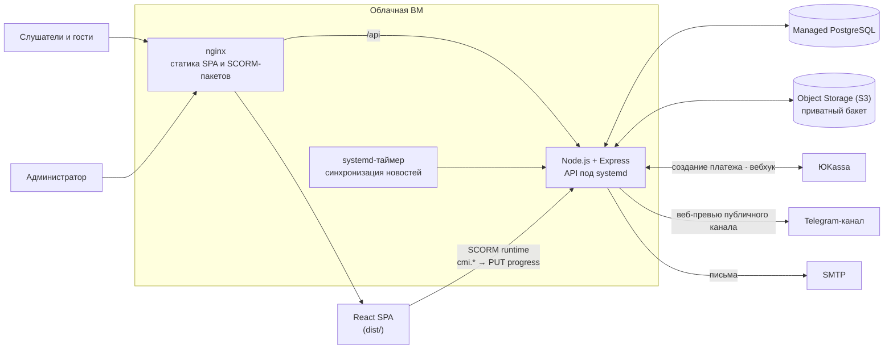

# LMS-платформа для бизнес-академии

Период: 06.2026 – 09.2026

> Сайт и личный кабинет образовательного проекта: каталог программ, онлайн-оплата, SCORM-курсы с серверным прогрессом, календарь вебинаров, форум, опросники, новости из Telegram-канала и полноценная админ-панель — весь контент создаётся из админки.

## Задача

Запустить собственную платформу обучения для бизнес-академии:

- публичная часть с программами и заявками на поступление;
- продажа доступа к программам с онлайн-оплатой;
- прохождение готовых интерактивных курсов (SCORM) с сохранением прогресса на любом устройстве;
- сообщество и коммуникации: события, форум, опросы, уведомления, новости;
- управление всем контентом без разработчика.

## Решение

- **Публичная часть:** главная, каталог программ с лендингами, заявка на поступление с согласием на обработку ПДн, новости, календарь событий.
- **Личный кабинет:** прогресс по курсам, события, уведомления, библиотека материалов, форум, опросники (один/несколько вариантов, шкала, текст).
- **Оплата через ЮKassa:** заказ создаётся на сервере по цене из БД с ключом идемпотентности, статус подтверждается перезапросом платежа, вебхук не доверяет телу уведомления.
- **Доступ к материалам** — только при оплаченном заказе или ручной выдаче (для сотрудников, преподавателей, тестировщиков); проверка в одном месте на сервере.
- **SCORM 1.2:** встроенный плеер с `window.API`, прогресс сохраняется на сервер и восстанавливается на любом устройстве.
- **Новости** автоматически подтягиваются из публичного Telegram-канала раз в сутки (и кнопкой из админки).
- **Админ-панель:** программы, события, новости, форум, материалы, конструктор опросников, уведомления, участники, заказы, заявки, SCORM-пакеты, управление базой.

## Моя роль

Проект делал один: архитектура, разработка, деплой. По коду — также фронтенд на React и API на Express, интеграция оплаты ЮKassa, SCORM-плеер с серверным прогрессом, синхронизация новостей из Telegram-канала, конфигурация развёртывания (systemd-сервис и таймер, nginx).

## Архитектура

## Стек

- **Фронтенд:** React 18, TypeScript (strict), Vite 5, React Router 6, Tailwind CSS 3, дизайн-токены
- **Бэкенд:** Node.js, Express, PostgreSQL (`pg`), S3 SDK для Object Storage, nodemailer, bcryptjs
- **Контент:** SCORM 1.2 (пакеты iSpring), jszip, lz-string
- **Платежи:** ЮKassa
- **Инфраструктура:** облачная ВМ, nginx, systemd (сервис + таймер), Managed PostgreSQL, Object Storage

## Ключевые технические решения

- **Клиент не диктует ни цену, ни доступ:** цена — из БД, доступ — по оплаченному заказу или выдаче, всё проверяется сервером; повторная оплата уже открытой программы отклоняется (409).
- **Служебная выдача доступа — отдельная таблица, а не фиктивный «оплаченный» заказ,** чтобы не портить выручку и отчёты по продажам.
- **Прогресс SCORM на сервере, localStorage — только кеш.** Процент считается по цепочке источников (`suspend_data` → `score.raw` → `lesson_status`), поддержаны два формата `suspend_data` (LZString+JSON и JSON). Прогресс только растёт: в начале нового сеанса пакет какое-то время рапортует нулями.
- **Автоисправление экспорта iSpring при сборке:** скрипты с «обрезанным» расширением переименовываются автоматически, иначе курс показывает пустой экран.
- **Честные 404 для SCORM:** пути пакетов исключены из SPA-перезаписи в nginx, чтобы поломка не выглядела немым пустым экраном.
- **Нет пароля администратора по умолчанию:** если он не задан, генерируется случайный и показывается один раз; в базе — только хеш. Без секрета подписи токенов вход не работает вовсе, а не работает небезопасно.
- **Сбой сети не отзывает доступ:** если проверить сессию не удалось, показывается прошлый список с пометкой, а не закрываются оплаченные программы.
- **Новости из Telegram без бота и токена** — через веб-превью публичного канала, идемпотентный upsert по id поста.

## Результат

По README репозитория:

- Работают публичная часть, кабинет, оплата через ЮKassa, SCORM с серверным прогрессом, новости из Telegram, админ-панель по всем разделам.
- Процент прохождения SCORM сверен с цифрой в собственной панели пакета: **расхождение не больше 1 %**.
- Осталось подключить: хостинг видео, лицензионные шрифты, серверное хранение ответов опросов и записей на события.

## Скриншоты

Скриншоты не публикуются: сервис работает с внутренними данными.
