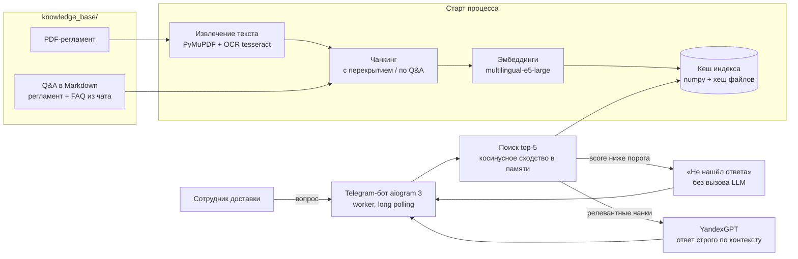

# RAG-бот для службы доставки

Период: 07.2026 – 07.2026

> Внутренний Telegram-бот для сотрудников службы доставки сети кулинарных лавок: отвечает на вопросы по регламенту доставки. Локальный семантический поиск по базе знаний + генерация ответа через YandexGPT строго по найденным фрагментам.

## Задача

Сотрудникам доставки нужно быстро находить ответы в регламенте (PDF-инструкция) — что делать, если курьер не назначен, как закрыть заказ агрегатора, как оформить возврат. При этом:

- никакой базы данных и векторных СУБД (требование проекта);
- вопросы пользователей не логируются;
- добавление документов — без изменения кода.

Отдельно был проведён анализ чата поддержки доставки, чтобы база знаний отвечала на реальные, а не придуманные вопросы.

## Решение

- **Индексация при старте:** текст из PDF (PyMuPDF) + OCR изображений и схем на страницах (tesseract, русский), чанки с перекрытием, эмбеддинги локальной моделью `multilingual-e5-large`. Markdown в формате «вопрос–ответ» режется по парам Q&A — это даёт максимальную точность поиска.
- **Кеш индекса** с проверкой по хешу файлов: если документы не менялись, индекс загружается без пересчёта.
- **Ответ:** эмбеддинг вопроса → top-5 чанков по косинусному сходству → если лучший ниже порога, бот сразу отвечает «не нашёл» и **не обращается к LLM**; иначе чанки идут в промпт, и YandexGPT формирует ответ строго по ним.
- **FAQ из анализа чата поддержки:** вопросы сформулированы «как в чате» («нет машины», «где курьер», «сумма не совпадает»), ответы пересобраны из действующего регламента со ссылками на страницы.
- **Команда `/shablon`** — готовый шаблон структурированного сообщения о проблемном заказе (рекомендация отчёта по стандартизации обращений).

## Моя роль

Проект делал один: архитектура, разработка, деплой. По коду и документации — также системный промпт для YandexGPT, индексация PDF с OCR и разбором Q&A, семантический поиск с порогом, FAQ по итогам анализа чата поддержки, деплой на Railway.

## Архитектура

## Стек

- **Бот:** Python 3.11, aiogram 3 (long polling, worker-процесс)
- **RAG:** sentence-transformers (`intfloat/multilingual-e5-large`), numpy (поиск в памяти), YandexGPT через httpx
- **Документы:** PyMuPDF, pytesseract + tesseract-ocr-rus, Pillow
- **Деплой:** Railway (Nixpacks ставит tesseract в образ)

## Ключевые технические решения

- **Без БД и векторных СУБД — требование проекта:** поиск идёт numpy в памяти, индекс кешируется файлом.
- **Порог сходства как фильтр расходов и галлюцинаций:** нерелевантный вопрос не доходит до LLM. В README описана методика калибровки: 15–20 реальных вопросов + заведомо «не по теме», сравнение `max_score` в логах.
- **OCR приклеивается к тексту той же страницы,** чтобы схемы и скриншоты в регламенте тоже находились поиском.
- **Приватность:** вопросы пользователей не логируются, памяти диалога нет — каждое сообщение обрабатывается независимо.
- **Падение при старте, а не на первом сообщении:** без обязательных ключей бот явно завершается с понятной ошибкой.
- **Не класть один материал в двух форматах** — дубли тем конкурируют в поиске и ухудшают ответы.

## Результат

По документации репозитория:

- Проанализирован чат поддержки доставки: **32 509 сообщений, 306 участников**. Выделены топ-проблемы — курьер не назначен / нет машины (1 155 обращений + 14 976 автоалертов), рассинхрон стоп-листа (667), оплата и закрытие заказов (585), опоздания (254), отмены и возвраты (152 + 48) и др.
- Свободная координация без шаблона составляла **5 803 сообщения (58 % живых обращений)** — под это сделана команда `/shablon`.
- Каждой топ-проблеме соответствует раздел FAQ в базе знаний бота; организационные рекомендации, которые ботом не решаются, вынесены отдельным списком.

## Скриншоты

Скриншоты не публикуются: сервис работает с внутренними данными.
