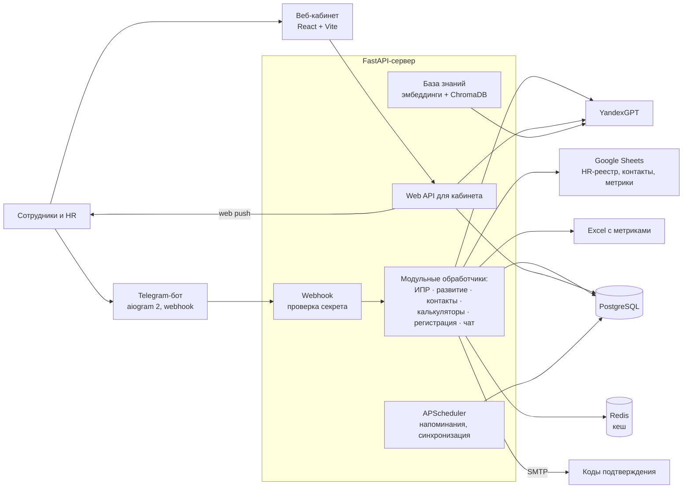

# HR-ассистент: Telegram-бот и веб-кабинет с ИПР на YandexGPT

Период: 08.2025 – 09.2026

> HR-платформа для розничного холдинга из нескольких сетей: генерация индивидуальных планов развития по модели 70/20/10, квизы и бизнес-кейсы, справочник сотрудников, зарплатные калькуляторы, база знаний с AI-поиском — в Telegram-боте и веб-кабинете.

## Задача

HR-службе нужен был единый помощник для сотрудников и HR-специалистов:

- составлять индивидуальные планы развития (ИПР) на основе результатов оценки и метрик сотрудника;
- проводить обучение: квизы по ценностям компании и бизнес-кейсы;
- давать сотрудникам справочник контактов, калькуляторы дохода и ответы на HR-вопросы;
- опираться на живые данные из Google Таблиц и Excel, а не на ручные выгрузки.

## Решение

- **ИПР:** сотрудник присылает PDF с результатами оценки или ФИО — бот подтягивает метрики из таблиц, сопоставляет слабые зоны с библиотекой развивающих действий (отдельные правила для каждого бизнес-направления) и генерирует план 70/20/10 через YandexGPT.
- **Развитие:** квизы по ценностям и бизнес-кейсы с подсчётом результатов.
- **Регистрация:** привязка Telegram-аккаунта к записи в HR-реестре по ФИО, выбор при нескольких совпадениях, подтверждение кодом на почту.
- **Справочник сотрудников** с поиском и навигацией по подразделениям.
- **Калькуляторы дохода** как Telegram WebApp.
- **Индивидуальные списки задач** с напоминаниями по расписанию.
- **HR-чат** в режиме дружелюбного ассистента на YandexGPT.
- **База знаний с AI-поиском (RAG):** семантический поиск и ответы с указанием источников по документам .txt/.md/.pdf/.docx/.html, админ-панель индексации.
- **Веб-кабинет (React):** главная, ИПР, развитие, контакты, калькуляторы, база знаний, чат, уведомления (web push), профиль, панели администратора и HR.

## Моя роль

Проект делал один: архитектура, разработка, деплой. По коду — также промпты для генерации ИПР и HR-чата на YandexGPT, база знаний с RAG на ChromaDB, интеграции с Google Sheets, Excel и SMTP, Telegram-бот, API и веб-кабинет на React, тесты на pytest.

## Архитектура

## Стек

- **Бот:** Python 3.11, aiogram 2.25 (webhook), FastAPI + uvicorn
- **AI:** YandexGPT; RAG — sentence-transformers (multilingual), ChromaDB
- **Данные:** PostgreSQL (SQLAlchemy, asyncpg), Redis, Google Sheets (gspread), pandas + openpyxl, pdfplumber, python-docx
- **Фоновые задачи:** APScheduler
- **Фронтенд:** React 19, Vite, React Router, Recharts, web push (pywebpush / VAPID)
- **Безопасность:** bcrypt-хеш пароля администратора, секрет вебхука
- **Деплой:** Railway / Docker, CPU-сборка torch без CUDA
- **Тесты:** pytest

## Ключевые технические решения

- **Модульная структура обработчиков:** по модулю на функциональную область (ИПР, развитие, контакты, калькуляторы, регистрация, чат, админка), у каждого — свои FSM-состояния.
- **Webhook вместо polling** — чтобы исключить конфликты 409 при перезапусках и деплоях.
- **Рекомендации по правилам + LLM:** слабые зоны сотрудника сначала сопоставляются с библиотекой действий по правилам (свои для каждого бизнес-направления), а YandexGPT оформляет из них план 70/20/10.
- **TTL-кеш** для часто читаемых данных (метрики, HR-таблицы) и ретраи с экспоненциальной паузой для внешних сервисов.
- **Экономия памяти:** локальная модель эмбеддингов выгружается из RAM после периода простоя; torch ставится CPU-сборкой, без многогигабайтного CUDA-стека.
- **Горячая перезагрузка Excel** командой без рестарта бота.

## Результат

По отчёту о тестировании в репозитории (миграция на модульные обработчики):

- Протестировано **8 из 9 модулей**, пройдено **7 из 8 (87,5 %)**; один модуль — частично (напоминания были в разработке).
- Работают: калькуляторы, квизы и кейсы, регистрация, генерация ИПР, справочник контактов, админ-команды, YandexGPT-чат.

## Скриншоты

Скриншоты не публикуются: сервис работает с внутренними данными.
