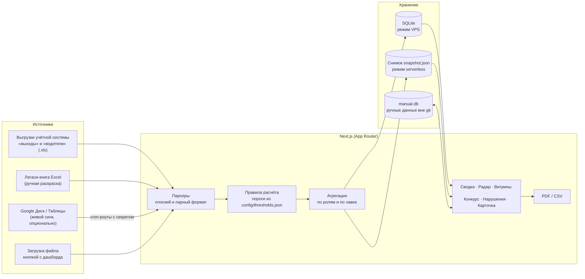

# Радар открытий: контроль открытия точек и наполнения витрин

Период: 08.2026 – 09.2026

> Внутренний дашборд сети кулинарных лавок: вовремя ли сотрудники и водители отмечаются при открытии и насколько наполнена витрина. Заменил ручную раскраску ячеек в Excel — статусы считаются автоматически из выгрузок учётной системы.

## Задача

Контроль открытия лавок вёлся вручную: сотрудник раскрашивал ячейки в Excel-книге зелёным, жёлтым и красным по каждому критерию — приход повара, кассира, бариста, приезд водителя, наполнение витрины. Это медленно, субъективно и не даёт увидеть картину по сети, по региональному менеджеру или по конкретной лавке во времени.

Нужно было:

- считать статусы автоматически по подтверждённым порогам;
- показать сводку по сети, проблемные локации и детализацию по лавке;
- принимать новые выгрузки без участия разработчика;
- дать место для ручных данных, которых нет в учётной системе (наполнение витрин).

## Решение

Веб-дашборд с несколькими представлениями:

| Экран | Что показывает |
|---|---|
| Сводка | Лавки в 🟢/🟡/🔴 по каждому критерию, топ и анти-топ, «где западает сильнее всего», время последних синков |
| Радар | Таблица «лавки × дни» с фильтрами: период, региональный менеджер, лавка, критерий, статус |
| Витрины | Ручной ввод наполнения — с двух сторон: «день → лавки» и «лавка → дни» |
| Конкурс по витринам | Баллы за день (🟢 +1 · 🟡 0 · 🔴 −1), статистика по лавкам и менеджерам, отчёт в PDF |
| Нарушения открытия | Четыре пункта заказчика (выезд с распределительного центра позже норматива, опоздания водителя и повара и др.), выгрузка в PDF и CSV |
| Карточка лавки | Время отметки каждого сотрудника по дням, **откуда взято время**, статус по каждому критерию |
| История | Журнал загрузок, состояние папки выгрузок, журнал правок витрин |
| Пороги | Действующие правила с пометкой, какие цифры ещё не подтверждены |

Выгрузки загружаются кнопкой прямо с дашборда — данными занимается вся команда, а не только тот, у кого открыт репозиторий.

## Моя роль

Командный проект, моя часть: чтение нового формата выгрузки учётной системы и загрузка выгрузок кнопкой с дашборда; свёртка повторных отметок; перенос ручных данных о витринах в отдельную базу вне git, их редактирование на сайте и журнал правок; вкладки «История», «Конкурс по витринам» с PDF-отчётом и «Нарушения открытия»; учёт выезда с распределительного центра; нормы открытия по каждой лавке; фильтры, сортировка и мобильная вёрстка.

## Архитектура

Компоненты, сделанные коллегами: первая версия дашборда (каркас, парсеры, правила статусов), режим снимка для serverless-хостинга и деплой-конфиг, учёт нарушений в конкурсе витрин.

## Стек

- **Frontend + backend:** Next.js 16 (App Router), React 19, TypeScript, Tailwind CSS 4
- **Хранилище:** SQLite (better-sqlite3) на сервере с диском; вкомпилированный снимок данных для serverless-хостинга
- **Данные:** SheetJS (разбор .xls/.xlsx), Google Drive API и Sheets API (живой синк)
- **Отчёты:** pdfmake (PDF), CSV
- **Тесты:** node:test через tsx
- **Хостинг:** Vercel (режим снимка) или VPS (полный режим с записью и кронами)

## Ключевые технические решения

- **«Всё, что вводит человек, — вне git; всё, что приходит выгрузкой, — в репозитории».** Правило появилось после того, как деплой однажды откатил вручную внесённые данные о витринах. Ручные данные живут в отдельной базе, которую деплой не трогает, и выгружаются в репозиторий одной командой как резервная копия.
- **Выгрузка важнее ручной раскраски.** Если по роли за день пришла выгрузка, ручные статусы по этой роли за этот день не используются; лавки нет в выгрузке — значит, она в этот день не работала, и красного за несуществующий день она не получает.
- **Топ и анти-топ считаются по-разному:** анти-топ — по числу красных (где чинить в первую очередь), топ — по доле зелёных; иначе наверх выходили бы крупные лавки с посредственными показателями. Рядом с долей всегда стоит «46 из 50 ячеек».
- **Итог радара — «7 из 8», а не «7»:** без знаменателя число не читается, а период переключается.
- **Дедупликация отметок:** из повторов остаётся самая ранняя реальная отметка, иначе один человек считался бы за двух.

## Результат

По README репозитория:

- Парсятся все источники, включая оба формата выгрузки учётной системы; статусы считаются по алгоритму ТЗ с подтверждёнными заказчиком порогами.
- За первые дни сотрудники считаются по табелю (**3059 отметок**), а не по раскрашенной вручную книге.
- В выгрузках найдено и свёрнуто **44 повтора** отметок.
- Наполнение витрин редактируется прямо в дашборде — Excel для этого больше не нужен.
- Тестовый набор: **248 тестов** — правила расчёта, парсеры обоих форматов, загрузка, витрины, снимок, запросы.

## Скриншоты

Скриншоты не публикуются: сервис работает с внутренними данными.
