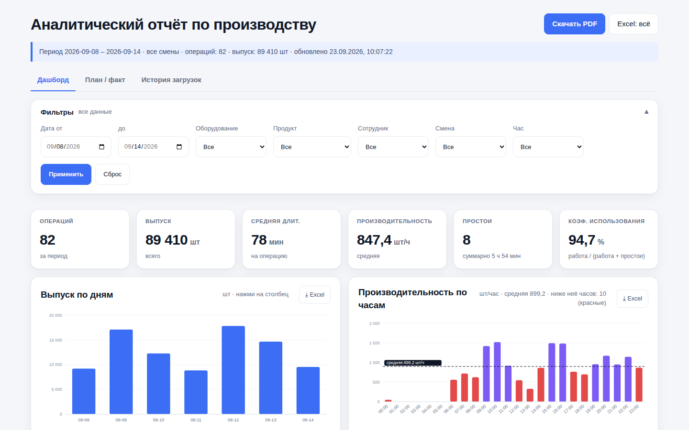
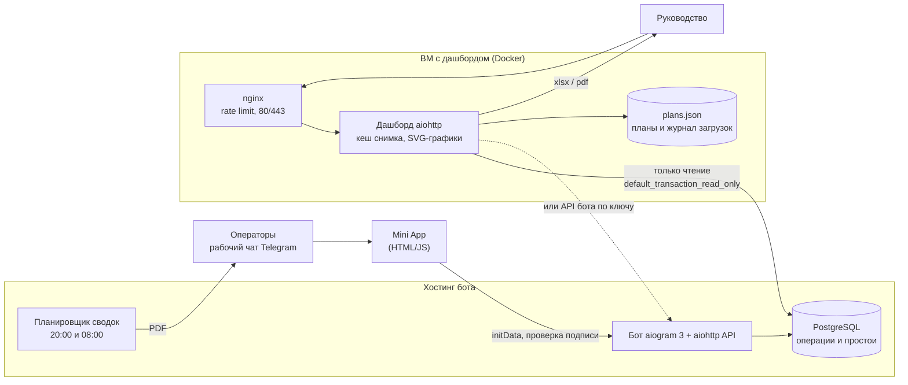
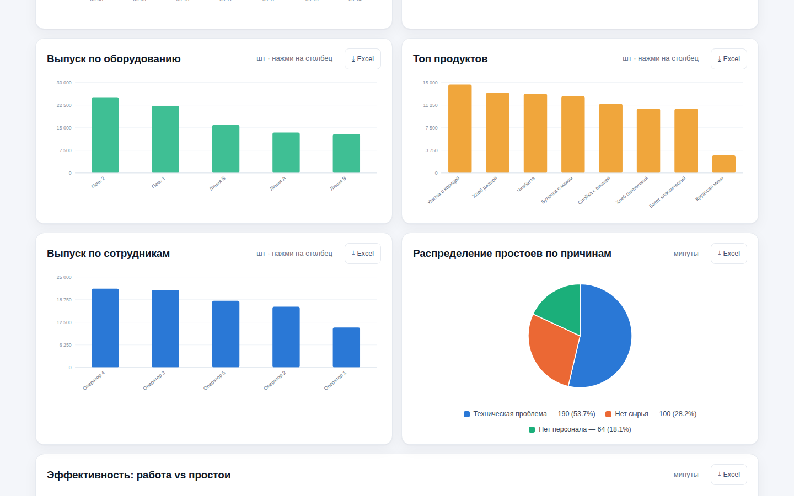
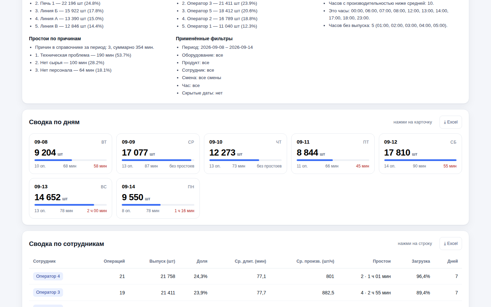
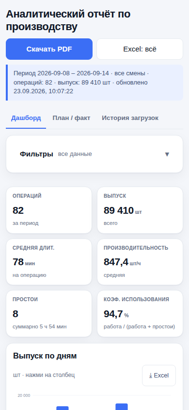

# Учёт и аналитика производства: Telegram Mini App + дашборд

Период: 08.2026 – 09.2026

> Операторы производственной площадки фиксируют начало и завершение производства и простои прямо из рабочего чата в Telegram; руководство получает дашборд с KPI, план/факт, выгрузки в Excel/PDF и две автоматические сводки за смену.

## Задача

Дать производству (хлеб, выпечка, полуфабрикаты) оперативный учёт: что, на какой линии и сколько выпущено, где и почему были простои, выполняется ли план. Данные собираются там, где работают люди, — в рабочем Telegram-чате, а анализируются в вебе.

## Решение

Три части:

1. **Бот + Telegram Mini App.** Оператор открывает приложение из рабочего чата и выбирает событие: «Начало производства», «Завершение производства» (с количеством), «Остановка — критическая» (с причиной: поломка, нет сырья, нет персонала, техническая проблема, качество). Оборудование и продукты выбираются из справочника с поиском.
2. **Автоматические PDF-сводки в рабочий чат:** за дневную смену (08:00–20:00) и за ночную (20:00–08:00).
3. **Веб-дашборд:**
   - 6 KPI: операции, выпуск, средняя длительность, производительность, простои, коэффициент использования = работа / (работа + простои);
   - выпуск по дням, производительность по часам с отметкой часов ниже средней, выпуск по оборудованию, продуктам и сотрудникам, простои по причинам;
   - «сводка фактов» — текстовая выжимка без домыслов и рекомендаций;
   - **план/факт:** загрузка рабочего шаблона плана в Excel, выполнение и недобор по позициям, журнал загрузок;
   - фильтры по периоду, оборудованию, продукту, сотруднику, смене и часу; клик по графику = фильтр;
   - выгрузка любого виджета в Excel с текущими фильтрами и всей сводки в PDF.

## Моя роль

Командный проект, моя часть: веб-дашборд — сервис только на чтение для ВМ (Docker, nginx), разбивка по сотрудникам, фильтр кликом по графику, мобильная вёрстка, план/факт с предупреждением о фильтрах, по которым план не разрезается, выгрузка виджетов в Excel и сводки в PDF, вкладки и журнал загрузок планов, автотест вёрстки на Playwright.

## Архитектура

## Стек

- **Бот и Mini App:** Python, aiogram 3, aiohttp, HTML/JS Mini App
- **Данные:** PostgreSQL (psycopg 3)
- **Дашборд:** aiohttp, чистый SVG без внешних CDN (работает в закрытом контуре), openpyxl (Excel), reportlab (PDF с кириллицей)
- **Инфраструктура:** Docker Compose, nginx с ограничением частоты запросов, порт сервиса слушает только localhost
- **Проверка вёрстки:** Playwright

## Ключевые технические решения

- **Дашборд физически не может писать в базу** — три уровня защиты: соединение с `default_transaction_read_only=on`, программная проверка «только `SELECT`/`WITH`», отсутствие в коде запросов на запись и миграций. Плюс `statement_timeout`, чтобы тяжёлый запрос не подвесил базу.
- **Один снимок данных в памяти,** обновляется не чаще раза в `CACHE_TTL` — нагрузка на базу не зависит от числа открытых вкладок.
- **Три режима источника:** прямое чтение базы, API бота по ключу (если база закрыта) и демо-режим для проверки деплоя без боевых данных.
- **Честный план/факт:** план в шаблоне разрезается только по дате, оборудованию и продукту — поэтому при фильтре по сотруднику, смене или часу плитка переименовывается в «долю от полного плана» и над ней появляется предупреждение. Недобор считается по отстающим позициям: перевыполнение одной позиции не закрывает провал другой.
- **Скрытие дат без изменения базы** — фильтр работает только на чтении.
- **Мобильная версия без горизонтального скролла:** таблицы превращаются в карточки, нажатия обрабатываются через `pointerup` с порогом движения, чтобы отличать тап от скролла.
- **Автотест вёрстки** прогоняет страницу по семи типовым разрешениям и дополнительно прочёсывает ширины 320–1920 px с шагом 40 px — ловит боковой скролл, обрезанный текст, неуместные переносы и мелкие зоны нажатия.

## Результат

Реализовано (по README дашборда и коду репозитория):

- Работают сбор операций из Mini App, две ежедневные PDF-сводки по сменам, дашборд с план/фактом, выгрузками в Excel/PDF и журналом загрузок планов.

## Скриншоты

Сняты на локальном стенде в демо-режиме со сгенерированными данными (вымышленные линии, продукты и операторы).

| Графики | Сводка по дням |
|---|---|
|  |  |

