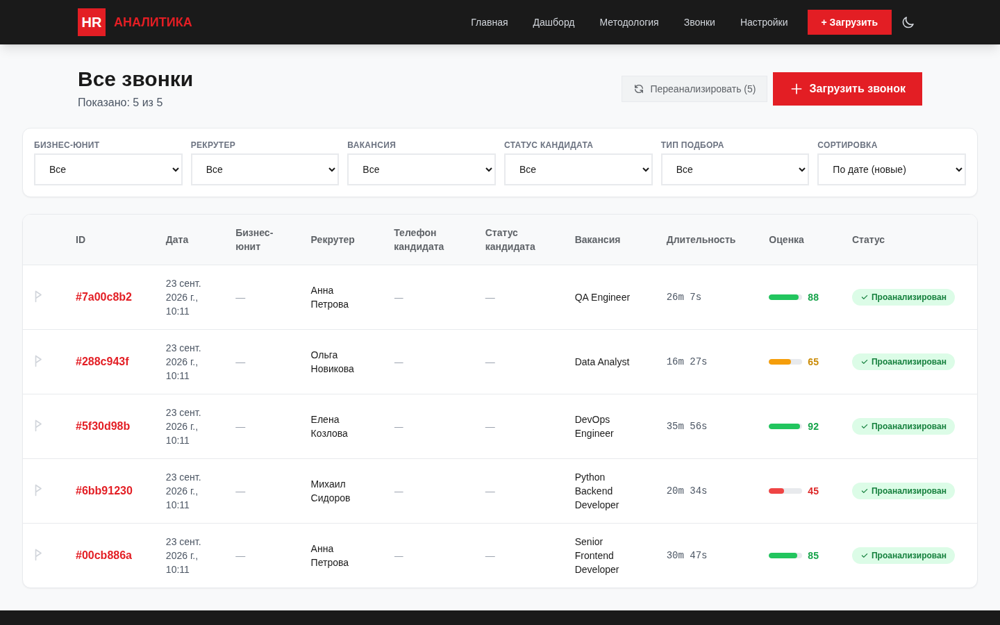
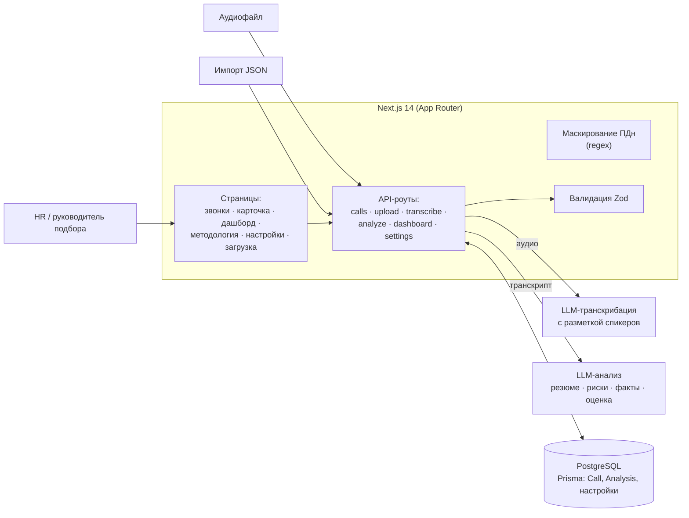
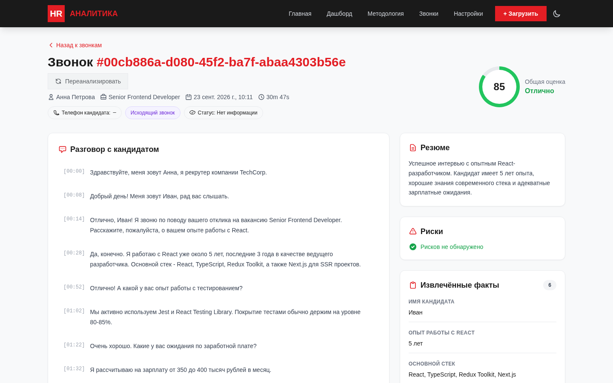
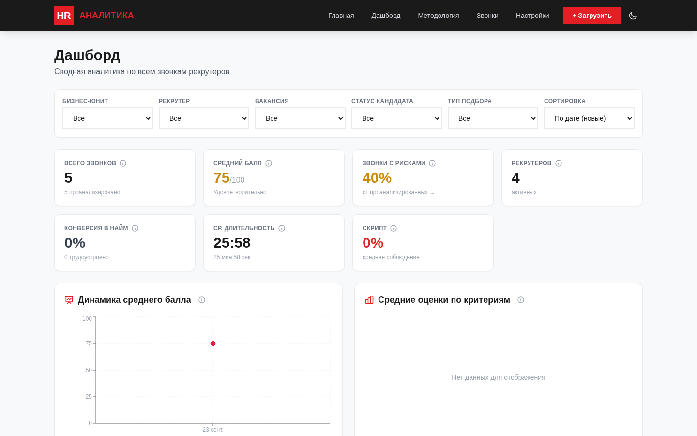

# Аналитика звонков рекрутеров

Период: 02.2026 – 03.2026

> Внутренний инструмент HR: транскрипт звонка рекрутера с кандидатом, AI-разбор (резюме разговора, риски, извлечённые факты, оценка по критериям) с привязкой каждого вывода к цитате и таймкоду, дашборд по рекрутерам и модуль маскирования персональных данных.

## Задача

Дать HR инструмент для разбора звонков рекрутеров (массовый и точечный подбор), который:

- превращает аудио в транскрипт с разметкой «рекрутер / соискатель»;
- автоматически выделяет риски, факты о кандидате и оценку по чек-листу;
- подкрепляет каждый вывод цитатой из разговора;
- защищает персональные данные кандидатов.

## Решение

- **Список звонков** с фильтрами по бизнес-юниту, рекрутеру, вакансии, статусу кандидата и типу подбора.
- **Карточка звонка:** транскрипт с таймкодами, краткое и подробное резюме, риски, извлечённые факты, общая оценка и разбивка по критериям. **Клик по цитате-доказательству подсвечивает нужный фрагмент транскрипта.**
- **Загрузка** аудиофайлов и импорт готовых транскриптов/анализов в JSON (по одному или пачкой).
- **Повторный анализ** звонка или пачки звонков.
- **Дашборд:** средний балл и его динамика, доля звонков с рисками, конверсия в найм, средняя длительность, соблюдение скрипта.
- **Методология и настройки** — описание критериев оценки и настройки скрипта для разных типов подбора.
- **Модуль маскирования персональных данных:** телефоны (российские форматы), e-mail, паспортные данные, адреса → `[REDACTED]`; покрыт тестами.

## Моя роль

Проект делал один: архитектура, разработка, деплой. По коду — также промпты транскрибации и анализа звонков, строгая схема результата и расчёт оценок, модуль маскирования ПДн с тестами на Vitest, интеграция с LLM API, деплой на Railway.

## Архитектура

## Стек

- **Приложение:** Next.js 14 (App Router), TypeScript, Tailwind CSS, shadcn/ui (Radix UI), Recharts
- **Данные:** PostgreSQL + Prisma ORM, валидация Zod
- **AI:** LLM API — транскрибация аудио с разметкой спикеров и анализ транскрипта
- **Тесты:** Vitest
- **Деплой:** Railway, PostgreSQL в Docker Compose для локальной разработки

## Ключевые технические решения

- **Доказательность вместо «чёрного ящика»:** у каждого риска, факта и балла есть `evidence` — цитата и интервал `startSec–endSec`, по клику интерфейс подсвечивает этот фрагмент транскрипта.
- **Строгая схема результата анализа** (резюме, риски с уровнем серьёзности, факты с уверенностью, оценка с разбивкой по критериям) — хранится в структурированных JSON-полях, сырой ответ модели сохраняется отдельно (`raw`) для отладки.
- **Жёсткие правила разметки спикеров в промпте транскрибации:** кто представляется от имени компании и объясняет условия — рекрутер; если имя рекрутера известно, оно передаётся в промпт подсказкой.
- **Определение бизнес-юнита по содержанию разговора** — для сравнения звонков разных направлений холдинга.
- **Маскирование ПДн — отдельный модуль** на регулярных выражениях: обрабатывает и полный текст, и сегменты транскрипта; в модели звонка есть флаг `piiRedacted`.

## Результат

- MVP с полным циклом: загрузка → транскрипт → анализ → карточка с доказательствами → дашборд.

## Скриншоты

Сняты на локальном стенде с демо-набором проекта (5 синтетических звонков, вымышленные компании и имена).

| Карточка звонка | Дашборд |
|---|---|
|  |  |
