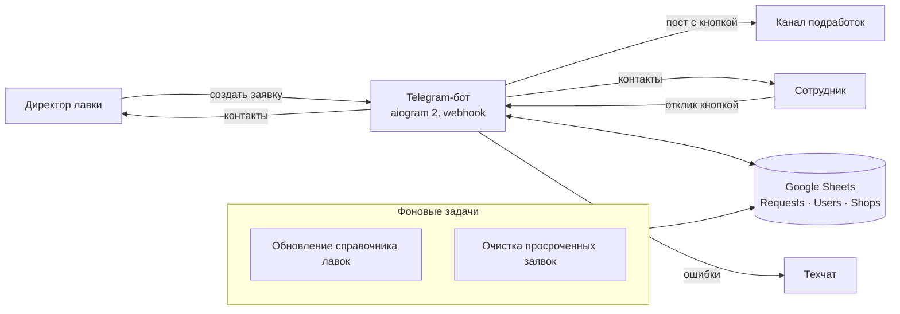

# Бот подработок: биржа смен для сети лавок

Период: 10.2025 – 03.2026

> Telegram-бот для сети кулинарных лавок: директора публикуют заявки на свободные смены в канал, сотрудники откликаются в один клик. Данные — в Google Таблице, без отдельной базы.

## Задача

Закрывать свободные смены в лавках силами сотрудников сети: директору — быстро опубликовать потребность (дата, время, позиция, лавка), сотруднику — увидеть её и откликнуться, обоим — получить контакты друг друга.

## Решение

- **Сценарий директора:** выбор лавки (район → станция метро → лавка, с пагинацией и поиском по метро), даты (быстрые кнопки или ввод в свободном формате), интервала времени, позиции и комментария → публикация поста в канал.
- **Сценарий сотрудника:** отклик кнопкой под постом, обмен контактами, счётчик занятых мест в заявке.
- **Защита от злоупотреблений:** лимит заявок в день на директора (по умолчанию 3), проверка корректности даты и времени.
- **Фоновые задачи:** периодическое обновление справочника лавок, очистка просроченных заявок.
- **Техчат:** уведомления об ошибках.

## Моя роль

Проект делал один: архитектура, разработка, деплой. По коду — также сценарии директора и сотрудника, хранение в Google Sheets, фоновые задачи, webhook-режим и тест генерации сообщений.

## Архитектура

## Стек

- Python 3.11, aiogram 2.25, aiohttp (webhook-сервер)
- Google Sheets как хранилище (gspread, google-auth, сервисный аккаунт)
- Деплой: Reserved VM (webhook), polling для локальной разработки

## Ключевые технические решения

- **Google Таблица вместо БД:** листы `Requests`, `Users`, `Shops` создаются ботом автоматически с заголовками при первом запуске; отдельная база не нужна.
- **Блокировка на заявку** (`asyncio.Lock` по id) — два сотрудника не могут одновременно занять последнее место.
- **Разбор даты «как пишут люди»:** быстрые кнопки и числовые форматы в свободной записи, ограничение горизонта в днях.
- **Webhook в продакшене, polling локально** — режим выбирается по наличию URL вебхука.
- **Ключ сервисного аккаунта передаётся через переменную окружения в Base64,** а не файлом в репозитории.

## Результат

- Реализованы оба сценария (директор и сотрудник), публикация в канал и хранение в Google Sheets.

## Скриншоты

Скриншоты не публикуются: сервис работает с внутренними данными.
