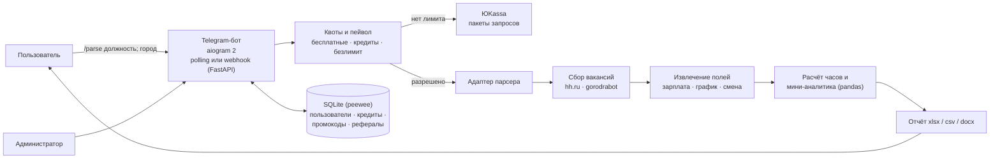

# Парсер вакансий: Telegram-бот аналитики рынка труда

Период: 09.2025 – 09.2025

> Бот собирает вакансии с джоб-сайтов по должности и городу, вытаскивает из текстов зарплату, график и длину смены и отдаёт отчёт в Excel/Word с краткой аналитикой. Монетизация — бесплатные запросы в месяц, пакеты через ЮKassa, промокоды и рефералы.

## Задача

Дать HR и рекрутерам быстрый срез рынка по должности в конкретном городе (например, «кассир; Москва»): какие зарплаты и графики предлагают работодатели и сколько часов в месяц за этим стоит.

## Решение

- **Запрос одной строкой:** `/parse кассир; Москва` или пошаговый диалог.
- **Сбор вакансий** из двух источников (hh.ru и gorodrabot) с фильтрацией по названию должности.
- **Извлечение полей из текста вакансии:** вилка зарплаты, график (включая добор из HTML страницы), длина смены, частота выплат, тип занятости, обязанности.
- **Расчёт** рабочих дней и часов в месяц по графику и длине смены — для сопоставимости предложений.
- **Отчёт** в Excel (по умолчанию), CSV или Word + мини-аналитика прямо в чате; отчётом можно поделиться.
- **Монетизация:** бесплатные запросы в месяц, пакеты запросов и безлимит на 30 дней через ЮKassa, промокоды с лимитом активаций и сроком действия, реферальная программа с бонусами.
- **Админ-панель в боте:** пользователи, выдача лимитов и безлимита, промокоды и статистика, рассылка.

## Моя роль

Командный проект, моя часть: Telegram-бот (диалог `/parse`, меню, обработка ошибок), адаптер к библиотеке парсера и превью строк с тестами, квоты и пейвол, оплата через ЮKassa, промокоды, реферальная программа и шаринг отчёта, админ-панель и рассылка, мини-аналитика в чате, прогресс генерации отчёта, структурированное логирование и диагностика, webhook-режим и деплой.

## Архитектура

Компоненты, сделанные коллегами: библиотека парсера вакансий — сбор, извлечение полей, аналитика и отчёты.

## Стек

- **Бот:** Python, aiogram 2.25, FastAPI + uvicorn (режим webhook)
- **Парсинг и NLP:** requests, BeautifulSoup + lxml, pymorphy2, razdel, rapidfuzz
- **Аналитика и отчёты:** pandas, numpy, openpyxl / XlsxWriter, python-docx
- **Данные:** SQLite через peewee, скрипт резервного копирования
- **Платежи:** ЮKassa SDK
- **Тесты:** pytest

## Ключевые технические решения

- **Парсер вынесен в отдельную библиотеку (vendor) и подключён через адаптер** — бот не зависит от изменений CLI парсера; различия версий задокументированы отдельно.
- **Единое решение по квоте** (`QuotaDecision`): режим (безлимит / бесплатно / платно / нет доступа), остаток бесплатных запросов и кредитов — одна точка правды для пейвола и сообщений пользователю.
- **Сохранение запроса на время оплаты:** если лимит кончился, запрос запоминается с TTL и выполняется после оплаты без повторного ввода.
- **Цены пакетов — из переменных окружения** в копейках с округлением через `Decimal`.
- **База вне репозитория** (`var/db`) с автоматическим переносом со старого пути.

## Результат

- Реализованы сбор, извлечение полей, расчёт часов, отчёты в трёх форматах, пейвол с ЮKassa, промокоды, рефералы и админ-панель.

## Скриншоты

Скриншоты не публикуются.
